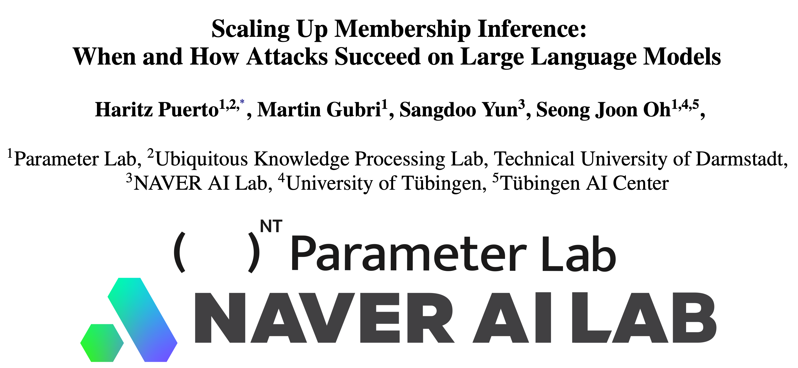
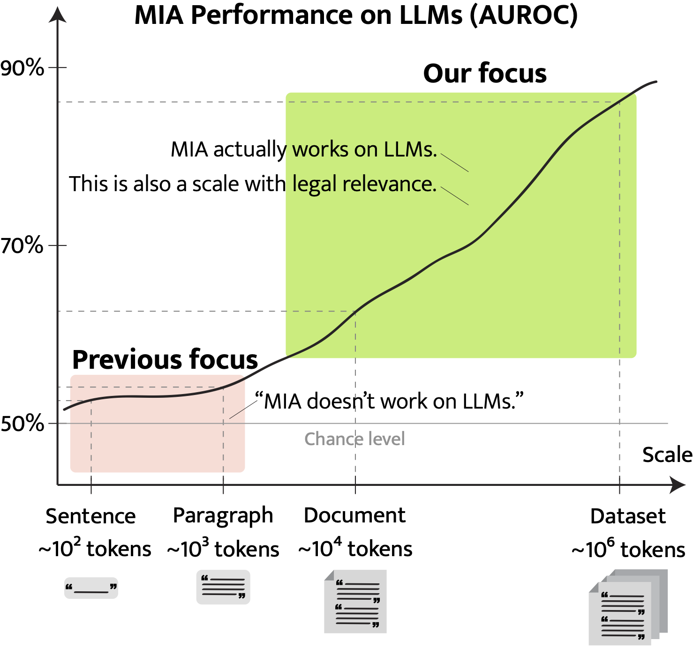

[](https://arxiv.org/abs/2411.00154)
[](https://huggingface.co/collections/haritzpuerto/the-pile-669689e96e4674605746ec6f)





This repository includes the code to compute the membership inference attacks (MIA) scores and their aggregation using statistical methods to scale up MIA across the text data spectrum as described in our 2024 arXiv paper "Scaling Up Membership Inference: When and How Attacks Succeed on Large Language Models." The precomputed MIA scores and all the results shown in the tables and figures of the paper are in the folder `results.`


Developed at [Parameter Lab](https://parameterlab.de/) with the support of [Naver AI Lab](https://clova.ai/en/ai-research).





> **Abstract**:
Membership inference attacks (MIA) attempt to verify the membership of a given data sample in the training set for a model. MIA has become relevant in recent years, following the rapid development of large language models (LLM). Many are concerned about the usage of copyrighted materials for training them and call for methods for detecting such usage.  However, recent research has largely concluded that current MIA methods do not work on LLMs. Even when they seem to work, it is usually because of the ill-designed experimental setup where other shortcut features enable ``cheating.''  In this work, we argue that MIA still works on LLMs, but only when multiple documents are presented for testing. We construct new benchmarks that measure the MIA performances at a continuous scale of data samples, from sentences (n-grams) to a collection of documents (multiple chunks of tokens).  To validate the efficacy of current MIA approaches at greater scales, we adapt a recent work on Dataset Inference (DI) for the task of binary membership detection that aggregates paragraph-level MIA features to enable document- and dataset-level MIA. This baseline achieves the first successful MIA on pre-trained and fine-tuned LLMs.


This repository provides:
* Code to run MIA attacks (`procompute_*.py` files)
* Code to run MIA aggregation (`{}_mia.py` files)
* Precomputed MIA attacks in `results/*/*/*/*/mia_members.json` and `mia_nonmembers.json`
* CSV files with the evaluation performance `results/*/*/*/*/*.csv`

## Reproducing the Experiments
This section will show you how to reproduce the experiments in our paper.

### Setup
First, install the requirements

```
conda create --name scaling_mia python=3.9
conda activate scaling_mia
pip install -r requirements.txt
```

Now, download the results data. In this .zip file you will find all the results used to plot the graphs, the raw MIA scores from the MIA attacks and the source text data in HuggingFace Dataset format.

```
wget https://huggingface.co/datasets/haritzpuerto/scaling_mia/resolve/main/results.zip 
unzip results.zip
```

### Running MIA Attacks

You can run the MIA attacks for a collection of documents using:


```
python precompute_collection_mia_scores.py \
    --model_name EleutherAI/pythia-2.8b \
    --dataset_name haritzpuerto/the_pile_00_arxiv \
    --output_path $OUTPUT_PATH \
    --seed 42
```

This script will run `perplexity`, `ppl/lowercase_ppl`,  `ppl/zlib`, and `min-l` attacks on the first 2048 (context window) tokens of each document.

Similarly, to run the MIA attacks on a document for Document-MIA you can use:

```
python precompute_document_mia_scores.py \
    --model_name EleutherAI/pythia-2.8b \
    --dataset_name haritzpuerto/the_pile_00_arxiv \
    --output_path $OUTPUT_PATH \
    --seed 42
```

This script will split the documents into 2048-tokens paragraphs and will run `perplexity`, `ppl/lowercase_ppl`,  `ppl/zlib`, and `min-l` attacks on them.


### Running MIA aggregation

```
python collection_mia.py \
    --mia_path results/collection_mia/EleutherAI/pythia-6.9b/haritzpuerto/the_pile_00_arxiv/2048
```
This script will aggregate the MIA scores of each document to do MIA at the collection level.

```
python document_mia.py \
    --base_path results/doc_mia/EleutherAI
```

This script will run over all model sizes, datasets, and paragraph sizes and will conduct document-MIA by aggregating the MIA scores of each paragraph.

## Cite

If you find our work useful, please consider citing it using the following citation:

```
@misc{puerto2024scalingmembershipinferenceattacks,
      title={Scaling Up Membership Inference: When and How Attacks Succeed on Large Language Models}, 
      author={Haritz Puerto and Martin Gubri and Sangdoo Yun and Seong Joon Oh},
      year={2024},
      eprint={2411.00154},
      archivePrefix={arXiv},
      primaryClass={cs.CL},
      url={https://arxiv.org/abs/2411.00154}, 
}
```

## Credits
The precompute MIA scripts are based on the code from https://github.com/swj0419/detect-pretrain-code.

This work was supported by the NAVER corporation.


## Disclaimer

> This repository contains experimental software and is published for the sole purpose of giving additional background details on the respective publication. 

✉️ Contact person: Haritz Puerto, haritz.puerto@tu-darmstadt.de

https://www.parameterlab.de/

Don't hesitate to send us an e-mail or report an issue if something is broken (and it shouldn't be) or if you have further questions.